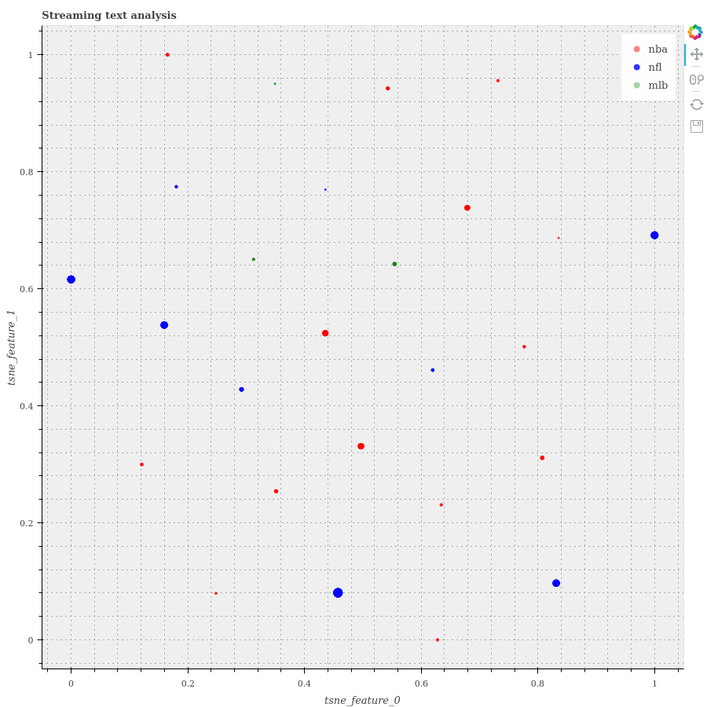
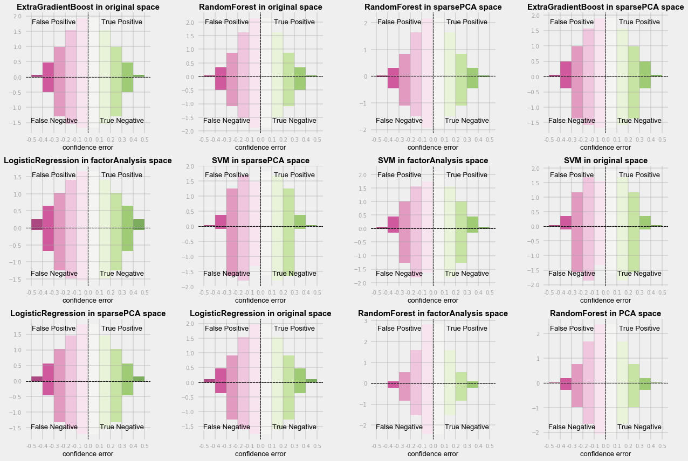

# Streaming Tweets Feature Learning with Spark
[Jump to repository](https://github.com/Xianlai/streaming_tweet_feature_learning)

#### As the diagram showing above, this project implements a pipeline that learns predictive features from streaming tweets and visualizes the result in real-time.

- **Receive streaming tweets on master machine**:    
    Running the TweetsListener.py script in the background, a tweets stream with 3 tracks-"NBA", "NFL" and "MBL" are pulled from Tweepy API. Inside this stream, each tweet has a topic about one of those 3 tracks and is seperated by delimiter "><". 

- **Analysis tweets on distributed machines**:    
    This stream is directed into Spark Streaming API through TCP connection and distributed onto cluster. Under the Spark Streaming API, the distrbuted stream is abstracted as a data type called DStream. A series of operations are then applied on this DStream in real time and transform it into other DStreams containing intermediate or final analysis results. 
    
    1. preprocess each tweet into a label and a list of clean words which contains only numbers and alphabets.
    2. count the frequencies of words in all tweets and take the top 5000 most frequent ones as features.
    3. encode the tweets in last half minute into a structured dataset using features mentioned above.
    4. calculate the conditional probability given label and the predictiveness of each feature word.
    
    
- **Visualize results on master machine**:   
    At last we select the tweets and features with higher predictiveness, collect their label, sum of predictiveness and 2 tsne features back onto the master machine and visualize them as a scatter plot. This visualization can be used as a informal validation of predictiveness defined above. If the scatter of different are well seperated, then the features selected by this predictiveness measure are valid.
    
    1. keep only 300 most predictive features and discard other non-predictive features.
    2. calculate the sum of predictiveness of each word in tweet.
    3. take 60 tweets with the highest sum of predictiveness under each label.
    4. apply TSNE learning on these 300 data points to reduce dimentionality from 100 to 2 for visualization.

# Mahattan Rental Apartment Clustering
[Jump to repository](https://github.com/Xianlai/Manhattan_rental_apartment_clustering)

A city functions like a gigantic sophisticate network. Within it each buildings and blocks are connected by visible transportation systems and invisible functional dependencies. But on the other hand, the difference of locations and functionality also divides the city into many sub-areas. For different purposes, the boundaries of these sub-areas are different. Like for political administration, we have boroughs, community districts and neighbourhoods, and for postal service, we have zip codes. 

In this projet, I would like to make use of rental apartment online listing dataset and new york building footprint dataset to explore the possible geographic boundaries or patterns of apartment rental market.

And we know that equivalent to finding boundaries, finding the best grouping of buildings with respect to their location and rental market popularity will help us understand the existing rental market data and get insights of its geographical form.

Performing unsupervised clustering technique, the direct problem we are facing is how to choose between a bunch of settings like different linkage, different distance metric etc. In this project, we are using 6 criteria including cluster sizes(data points count), cluster geometric area size, within cluster variance, between cluster variance etc. as 6 scoring systems. And through studying how these scoring system behaves and diverse, we are able to choose whether to fuse score of each system or to fuse rank of each system in choosing final clustering model settings.

And at last we compare how different rental listing features like doorman, fitness center, bedroom numbers etc affect the pattern of Manhattan apartment rental popularities.

# Online News Popularity Classification
[Jump to repository](https://github.com/Xianlai/online_news_popularity_classification)

## Abstract:
Facilitated by the fast spreading and developing of internet and smart devices, how can we understand online news browsing data and find the pattern inside it become more and more important.

In this project I am using online news popularity data set containing 39644 news articles and 57 features about each article including statistical features like number of words in title, rate of non-stop words in the content, article publish weekdays etc. and NLP features like positive word rate, title subjectivity level etc. The goal is to classify whether these articles are popular or not quantified by article shares. 

## Motivation:
The main motivation of this project is not aiming at developing a new method or fine tunning a state of art model to achieve extreme high accuracy. The focus here is to set up a systematic procedure and framework to understand the dataset and compare different models on this dataset.

0_Preprocessing.ipynb:
- By investigating mean, std, range, unique value counts and outlier counts, we are able to merge related features, remove outliers and standardize the dataset for future model fitting.
- By decompositing data set using differnt method like PCA, sparse PCA, factor analysis and NMF, we are able to look at the dataset from more perspectives and possibly improve the model performance.

1_Model fitting and selection.ipynb:
- By setting up performance evaluation, expected loss, as sum of square bias and variance, We are able to find the balance between model's flexibility and steadiness.
- By visulizing the results of parameter tunning, we can understand how each of the parameters changed the model's behavior on this dataset.
- By comparing the decision boundaries of model before and after parameter tunning, we are able to tell how does model adapt to this dataset and identify possible problems and improvements.
- By plotting the histogram of prediction confidence, we are able to understand better how predictions are made by different models, and discard problematic ones which looks fine if we just judge by expected loss.

# General Tree Search and Visualization
[Jump to repository](https://github.com/Xianlai/online_news_popularity_classification)

Searching is one of the most flexible way to deal with problem that can't be solved directly and exactly. By systematically exploring the state space, we will eventually reach the goal state we are looking for. If what we are interested is the path from initial state to goal state, then we need to save the states and orders we explored in a tree structure.

This small project includes implementation of a general tree search algorithm module that can employ different searching strategies like depth-first search, iterative deepening search, A* search etc. and a visualization module that can visualize the result search tree nicely.

