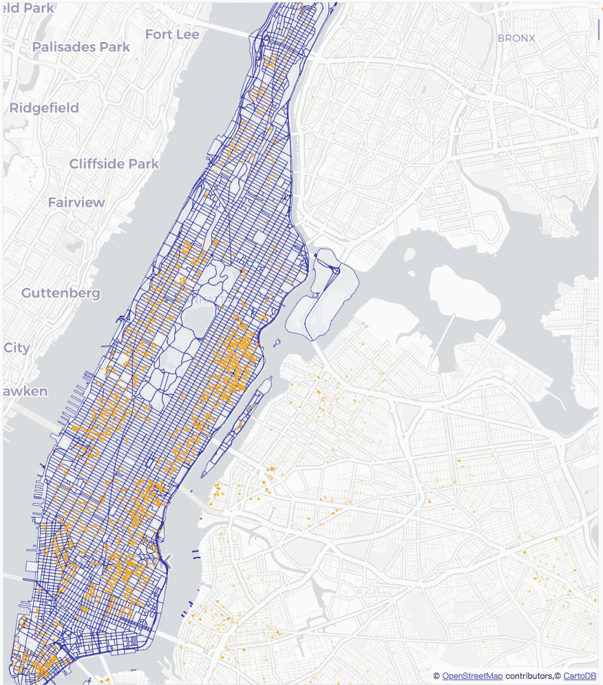
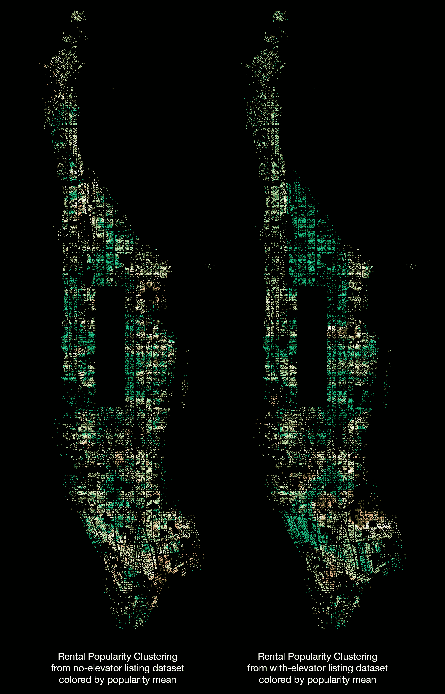

Last updated at August-19-2018

# Contact   
Email: xian_lai@126.com   
Cell: 86-159 0115 2972   
Addr: 百子湾路32号院1号楼，朝阳，北京，100022    

___


# RNN as a Multivariate Arrival Process Model
# 循环神经网络在时间序列的学习与预测上的应用
[GitHub repository](https://github.com/Xianlai/taxi-trips-prediction-with-RNN)


Understanding time-related geospatial data is a very interesting and challenging task, but is necessary to support an efficient and intelligent urban environment. In this study we model taxi trips in New York City from historical data and by using a recurrent neural network. The goal of the model is to gain a better understanding of the spatial-temporal patterns related to taxi travel in New York City, so that we can better predict demand. **This study uses the taxi domain to explore the usage of different neural network models for this type of prediction task.** In particular, three types of recurrent neural network cells are evaluated: **vanilla cells, Long Short Term Memory cells, and Neural Turing Machine cells**. The internal states of these models are also examined, during the learning process, to better understand the key features of the different cell structures.

### I. Introduction
### I. 背景知识介绍

According to 2016 New York City Taxi and Limousine Commission Factbook, in 2015, 13,600 licensed yellow taxi cabs made between 300,000 and 400,000 trips per day. Providing a reasonably accurate prediction of when and where passenger demand will occur is of great importance to taxi drivers and their companies, as this information can save time and fuel, and maximize profits. This information will also benefit passengers, since it would increase the availability of these transportation services, especially at busy hours and popular locations. It can also help to mitigate traffic congestion, reduce air pollution, and help inform other urban transportation systems (e.g., bike-sharing and ride-sharing services).

Several studies focused on this problem with spatial-temporal datasets, prompted by the advent of sensor technologies like GPS and WiFi, which are easily incorporated into vehicles, or are available via the ride or car-sharing businesses that rely on smartphones. These studies all used ARMA models or their variations. These models describe the prediction as a weighted combination of a sequence of historical observations, and a sequence of errors following normal distribution, and only work with univariate data. However analytical problems with geographical data often requires a full understanding of environment rather than a single spot. To better model the process under a complicated urban environment, it is beneficial to incooperate the environment itself into the model, not only local environment like neighborhoods, but also global environment like the entire city if possible. In other words, we should build a multivariate model taking account of taxi cab drop-offs in all locations, in order to predict the arrival rate in any particular location. In this study, we present 3 types of RNN models that can handle multiple arrival processes simultaneously and learn the complicated relationship between them.

### II. Data Set and Preprocessing
### II. 数据集探索与清理

The yellow taxi trips data set used in this study was collected and made available online by New York City Taxi and Limousine Commission. The data set contains most of the yellow taxi trips in New York City from 2009 to 2017. The machines installed on each taxi logs, for each trip: the pickup and drop-off coordinates, timestamps, durations, distances, fare charged, and passenger count reported by the driver. For this study the drop-off GPS coordinates, drop-off timestamps and passenger counts were extracted and utilized.

This data was then preprocessed as follows. The trips were aggregated by predefined GPS coordinate grids and drop-off hours. Following figure shows a visual representation of the data, where the opacity of each grid represents the number of drop-offs in the grid. Fig. 1 corresponds to the first hour in 2009. The figure shows that yellow taxis are quite busy on New Year’s Eve, especially in Manhattan, with the exception of Harlem. One particular grid, grid 453 in Lower Manhattan near the Wall Street subway station, is highlighted because we designate this as the destination grid for our study—and focus on predicting the counts of passengers dropped off at this grid.


As the preprocessed data shows, the travelling demand varies significantly across time and location. Locally, each coordinate grid exhibits its own volume and pattern, while the whole system shows a certain degree of continuity in space and time. Grid 453 has an intermediate level of volume and has a typical traffic pattern for an office area (when looking at data outside of New Year’s Eve). Following figure shows the hourly pattern of all weeks in 2009 at grid 453. The plot starts from Thursday and ends at Wednesday, and the weekend is designated by light grey shading. The tenth and ninetieth percentiles, and the means at the same hours of each week, are plotted and compared with the 1 st week. We can see that the pattern from Friday night to Sunday evening are quite different from the other times, but in general, they follow a pattern over time.


### III. Recurrent Neural Network and Cell Structure
### III. 循环神经网络及其单元细胞

In this section we provide relevant background knowledge about Recurrent Neural Networks (RNNs), and the types of RNN cells that are used in our experiments. RNNs are powerful sequential data learning models, and consequently are widely used in domains like speech recognition and machine translation, especially when the input and output are variable-length vectors. RNNS are a subclass of artificial neural networks (ANNs), and as such they inherit the capabilities of ANNs to learn hidden variables and layers of abstraction. The inputs of an RNN are encoded as hidden variables, merged with information from previous time steps and lower layers and passed to later time steps and higher layers. The portion of an RNN involved in one time step is called a cell. The whole RNN can be seen as a cell unrolled along the time dimension. Each cell maintains an internal state (memory) to process inputs at the current time step.

**A. Vanilla Cell**

The Vanilla cell is the most basic type of RNN cell. As Following figure shows, in each time step, the cell performs following tasks:  

1. the preprocessed input data is concatenated with the cell memory from prior time step;  
2. the concatenated information is linearly projected back to the hidden layer size as new cell state;  
3. the new cell state is passed through a 𝑡𝑎𝑛ℎ activation function to squeeze values into range [-1, 1];  
4. the squeezed cell state is then passed to next time step or ejected out as output from this time step.  


However, one well known problem of vanilla cell is that its cell state is directly exposed to the modification of input data so it is not stable and can explode or vanish when the RNN chain is long.


**B. LSTM (Long Short Term Memory) Cell**

The Long Short Term Memory (LSTM) proposed in 1997 by Sepp Hochreiter and Jürgen Schmidhuber, and improved in 2000 by Felix Gers' team, attracted a lot of attention due to its state of art performance in many time series learning tasks. As can be seen in Following figure, LSTM is more complicated than the vanilla cell. Besides the global cell state (long term memory) that passes through the entire sequence, it also has the local cell state (short term memory) that is only passed one time step. And it employs "gate" components to control the amount of modification to cell state. In each time step:   

1. the preprocessed input is first concatenated with short term memory from the last time step;  
2. this concatenated information is then linearly projected to hidden layer size and passed through the activation function just like the vanilla cell as new input j;  
3. this concatenated information is also used to generate the forget gate f, add gate i, and output gate o, which controls how much information in long term cell state should be forgotten, how much of new information should be added, and how much information in new long term memory should be output as short term memory;  
4. finally both the long term and short term memory is passed to next time step. The short term memory is also ejected as output.  


The gates protect the internal state from direct modification of inputs. If the concatenated information is not helpful for final prediction, the forget gate and add gate will be closed and the long term memory remains unchanged. So the internal state is more consistent (smooth).

**C. NTM (Neural Turing Machine) Cell**

Although the LSTM cell provides a stable and consistent long term cell state, it still has a big limitation: it can only remember and update "the current situation." It would be better if it could temporarily save the situations it encountered, so that for new predictions it can check the current situation against this temporary knowledge base. From the Bayesian perspective, the temporary knowledge base serves the role of prior distribution; in each time step the prior distribution is updated by the current situation and the posterior value, as informed by the current situation, is outputted. The learned knowledge base should be passed between iterations and saved as part of learned model for future predictions—this is unlike the vanilla or LSTM cells that only pass learned model variables.

The Neural Turing Machine cell proposed in 2014 by Graves, Wayne and Danihelka provides the benefits just described. An NTM cell is composed of two parts: controller and memory. The controller can be any type of RNN cell, while the memory is an n by m array (n memory slots of size m) with one or more reading and updating heads. The memory maintains a distribution of hidden variables along time. The following operations are performed by heads in each time step:

- update, performed by updating heads: The outdated knowledge is updated by first erasing then writing. The updating can be performed on multiple slots and by multiple heads simultaneously.

- read, performed by reading heads: In next time step, the reading heads retrieve the relevant information from one or more slots in previous updated memory.

The updating and reading operations performed by different heads are independent of each other, and the slots written to and read from, can be different as well. The slots to read and write is decided by a process called attention focusing which is discussed in Section VB.


### IV. Experiments
### IV. 实验与结果

**A. Description of Experiments**

Experiments were performed to compare RNN models with the three different types of cells mentioned in Section III. These models were trained to learn the spatial and temporal dependencies in the taxi dataset described in Section II, and then make short term predictions of passenger drop-off counts at grid #453. The predictions are based on the historical observations of all 5625 grids for the previous 24 time steps. All of the trips from the 1000th hour to the 3000th hour in 2009 were used for training, and the trips from the 3000th hour to 4000th hour were used for testing (i.e., evaluation). The first 1000 hours were omitted because they correspond to the holiday season at the beginning of January and are expected to exhibit a different pattern.

The three RNN models with different cell types were each trained for 150 iterations utilizing the same training data. As illustrated in Following figure, in each training iteration, the inputs were rescaled into the range [-1, 1] and then fed into the RNN cell. Predictions were compared to the real data in the 25th hour, and the root mean squared error of training batch was calculated as loss value. It represents the difference of passenger counts between the predicted and actual value. Each induced model was evaluated using the testing data to predict the same 100 randomly selected time intervals. The mean and standard deviation of errors of these 100 predictions are calculated to show the accuracy and stableness of these models.


For the RNN models with NTM cell, we chose the LSTM cell as controller and connect the update heads of memory to the long term cell state and read heads to short term cell state as following figure shows. The long term cell state (current situation) is not only passed to next time step directly, but also written to the memory; in the next time step, the similar situations are read from the memory as an additional input for the cell together with long/short term cell state and data input. The number of memory slots is set to 128, and the size of the memory slot is the same as hidden layer size of the controller.


**B. Experment Results**

In this experiment we compare the performance of the three types of cells in the training phase and testing phase using 1 hidden layer of size 100.

Left side of following figure shows the batch losses for 3 types of cells in the training phase. As mentioned before, the loss is the error of prediction for grid #453. The batch loss is the average of losses in a training batch of size 20. For each model, we performed 20 repetitions using the same training set and testing set. The batch losses of each iteration of 20 repetitions is recorded. The 10th and 90th percentile for each cell are calculated and plotted in the figure. In 300 training iterations the LSTM cell outperformed the vanilla cell—it converged faster and achieved a lower mean batch loss. The NTM cell is too unstable for this learning task and constantly give bad predictions. The results on the test set are provided in right hand side. Based on these results, the LSTM cell yields the most accurate predictions and the stable predictions.


### V. Internal State of Models
### V. 模型内部学习过程剖析

In this section we examine the internal state of all 3 types of cells and the state of memory component in NTM cell during the training phase.

**A. State of cells**

All processes learned by models are encoded as hidden variables in the internal cell state. They were investigated in terms of following:  

1. The best groupings of grids—hidden variables in cell states—that have most predictable periodic patterns. Each can represent the traffic flow for a certain function, like an office building in the destination grid. If the model has more than one hidden layer, multiple layers of groupings will be used.
2. The optimal amplitude, frequency and phase of periodicity of each hidden variable. The model should be able to learn the periodicity of each individual hidden variable and fit the input sequence in the learned cycle.

Left hand side of following figure shows how the state of #15 hidden variable (one of many hidden variables with visible intensity pattern) of 3 types of cells were built up along time steps and modified in training iterations. It uses x axis as time step, y axis as iteration index and brightness to show intensity. Along the x axis, we can see in the first few time steps, all 3 models were building the cell state by adjusting the intensity level of this hidden variable. Both NTM cells and LSTM cells showed a nice learning process. The #15 hidden variable was first given high intensity and then gradually lowered to reduce the loss value. The vanilla cells struggled to find a stable level. The variable state fluctuated at the beginning due to the direct impact of noisy inputs. Along the y axis, LSTM cells found reasonable parameters for cell components almost right away. Vanilla cells took a few more iterations, and NTM cells costed around 80 iterations.

In right hand side of figure, we show the weighting of all hidden variables in the last training iteration. Among 100 hidden variables used, only a portion of them are important for prediction—the others are ignored and thus have low intensities. The number of useful hidden variables in the 3 types of cells are all different. Vanilla cells use the least number of hidden variables while LSTM cells used more. Also, in the beginning time steps, we observe that the intensity adjustment process mentioned previously is not unique to #15 hidden variable.


**B. State of memory component in NTM cell**

The state of the memory component in the NTM cell in an intermediate training iteration is shown in left hand side of following figure. In it we can see the distribution of hidden variables spanning across memory slots. The newly updated slots in this iteration has higher contrast than other slots. Which slots to be updated or read are decided by attention focusing processes performed by read and update heads. The focus processes for different heads are similar except the long term cell state is used as key vector in updating and short term cell state from last time step is used as key vector for reading. Both of them are made of 2 steps:

a) focus by content:  

1. A cosine similarity vector is generated by comparing the key vector to each memory slot (cosine similarity is independent of magnitude of signal, so similar information is picked up even if the signal is weak).
2. This similarity vector is then sharpened so the most relevant information has higher probability to be read or updated.
3. Finally, the sharpened similarities are normalized as a probability distribution.

b) focus by location:  

1. The distribution from focus by content is then linearly combined with weights at previous step controlled by a gate value. This step is used to prevent heads jumping around too easily. Time steps are continuous, the slots chosen in this time step should be close to where the memories are written in the past as well.
2. This linearly combined distribution is convoluted with a kernel decided by key vector. This step is used to take account of a few neighboring locations in distribution and shift the heads forward to other memory slots.
3. Finally, the convoluted distribution is sharpened again and normalized as final weights. The sharpening is also used for choosing the most relevant information.

Focusing by location can be seen as a procedure of heads designed for time series models. As time move 1 step forward, the heads are shifted forward as well. And the focusing by content is used to correct this procedure based on similarity. 

Right hand side of figure shows the weights of all memory slots when performing reading and updating in each time step at last iteration. We can see both reading head and update head found 3 similar situations and gave weights corresponding to the similarity in each time step. Due to the focusing by location, the heads are shifting along time steps reading the "next scene” it remembers. Due to the focusing by content, the leftmost situation is adjusted leftward at around time step 3. The sharpening strength in both steps needs to be tuned. If the strength is too high, the heads will only pick up the most similar case. If the strength is too low, too many cases will be read or updated thus the memory will act like only has one slot.


### VI. Conclusion
### VI. 结论

In this study we evaluated 3 types of RNN models for multivariate arrival process learning. They incorporate the time series data of all geospatial locations and learn the relationship between them by encoding them as small number of hidden variables. Although we only used them to predict one location in experiments, the models can be used to predict the arrival rates of any number of locations without modification. Among them, the models with LSTM cells are most stable and give the most accurate predictions due to the protection of gate components. The noise in inputs are filtered away when they go through the gates and the cell state has more clear periodicity comparing to other models.

___


# Streaming Tweets Feature Learning with Spark
# 推特流数据实时特征学习(Spark Streaming)
[GitHub repository](https://github.com/Xianlai/streaming_tweet_feature_learning)


As the role of big data analysis playing in ecommerce becoming increasingly important, more and more streaming computation systems like Storm, Hadoop are developed trying to satisfy requirements of both time and space efficiency as well as accuracy. 

Among them, Spark Streaming is a great tool for mini-batch real-time streaming analysis running on distributed computing system. Under the Spark Streaming API, the data stream is distributed on many workers and abstracted as a data type called DStream. DStream is essentially a sequence of Resilient Distributed Datasets(RDDs). A series of operations can then applied on this sequence of RDD's in real-time and transform it into other DStreams containing intermediate or final analysis results.

In this project, a live tweets streaming are pulled from Tweeter API. 300 most predictive features words for hashtag classification are learned from this stream using Spark Streaming library in real-time. To validate the learning process, these 300 features are are reduced to a 2-d coordinate system. New tweets are plot on these 2 dimensions as scatter. As more and more tweets  learned by the system, the tweets with same hashtag gradualy aggregate together on this 2-d coordinates which means they are easily separable based on this features.

### I. Receive and clean streaming tweets:  
### I. 接收和清理推特数据流:

1. Running the [TweetsListener.py](https://github.com/Xianlai/streaming_tweet_feature_learning) script in the background, a tweets stream with any one of 3 tracks-"NBA", "NFL" and "MBL" are pulled from Tweeter API. 

    ```
    example raw tweets:  
    Here's every Tom Brady Postseason TD! #tbt #NFLPlayoffs https://t.co/2CIHBpz2OW...  
    RT @ChargersRHenne: This guy seems like a class act.  I will root for him  
    RT @NBA: Kyrie ready! #Celtics #NBALondon https://t.co/KgZVsREGUK...  
    RT @NBA: The Second @NBAAllStar Voting Returns! https://t.co/urTwnGQNKl... 
    ... 
    ```

2. Each tweet in the raw tweet stream is then been preprocessed into a label and a list of clean words containing only numbers and alphabets.

    ```
    example cleaned tweets after preprocessing:   
    tag:1, words:['rt', 'chargersrhenne', 'this', 'guy', ...],    
    tag:0, words:['rt', 'debruynekev', 'amp', 'ilkayguendogan', ...],    
    tag:0, words:['rt', 'commissioner', 'adam', 'silver', ...],    
    tag:0, words:['rt', 'spurs', 'all', 'star', ...],    
    tag:0, words:['nbaallstar', 'karlanthony', 'towns', 'nbavote', ...],   
    ...    
    ```

3. we will split training and testing data set from clean tweets stream. One third of the tweets are preserved for future result validation. 


### II. Feature extraction:    
### II. 特征抽取: 
These words are counted and top 5000 most frequent words are collected as features for continue learning.
        
    ```
    example word count:  
    ('rt' , 196)  
    ('the', 174)  
    ('in' , 85)  
    ('for', 62)  
    ('to' , 59)  
    ...
    ```


### III. Feature predictiveness learning
### III. 特征预测能力值测算: 
1. encode the cleaned tweets stream into a structured dataset using features mentioned above.

    ```
    example encoded dataset:  
    tag: 0, features: [1, 0, 0, 0, 0, 0, 0, 0, 0, 0, ...],  
    tag: 1, features: [1, 0, 0, 0, 0, 0, 0, 0, 0, 0, ...],  
    tag: 2, features: [1, 0, 0, 0, 0, 0, 0, 0, 0, 0, ...],  
    tag: 0, features: [0, 1, 1, 1, 1, 1, 0, 0, 0, 0, ...],  
    tag: 1, features: [0, 0, 1, 0, 0, 0, 1, 1, 1, 1, ...],  
    ...  
    ```

2. calculate the conditional probability given label and the predictiveness of each feature word.

    **p(feature|tag)**:   
    Since all the feature values are either 0 or 1, we can easily get the probability of one feature conditioned on any tag by counting the tweets containing this feature under corresponding tag and divide it by the total count of tweets under this tag.

    <a href="http://www.codecogs.com/eqnedit.php?latex=cp_0&space;=&space;\frac{count(feature=1,&space;tag=0)}{count(tag=0)}" target="_blank"></a>

    **predictiveness**:  
    Then we calculate the predictiveness of each feature from this dataset. The predictiveness of one feature quantifies how well can a feature discriminate the label of a tweet from other 2 labels.

    1. If we have only 2 labels, it can be defined by the bigger ratio of conditional probabilities of this feature given tags.
        
        <a href="http://www.codecogs.com/eqnedit.php?latex=pdtn(label_1,&space;label_2)&space;=&space;arg&space;max\left(&space;\frac{p(word|label_1)}{p(word|label_2)},&space;\frac{p(word|label_2)}{p(word|label_1)}\right)" target="_blank"></a>

    \*Note that this measure is symmetric. In other words, how much a feature can distinguish label 1 from label 2 is the same as how much it can distinguish label 2 from label 1.
        
    2. When we have more than 2 labels, we can take the average of the predictivenesses of all label combinations.
        
        <a href="http://www.codecogs.com/eqnedit.php?latex=pdtn(label_1,&space;label_2,&space;label_3)&space;=&space;\frac{pdtn(label_1,&space;label_2)&space;&plus;&space;pdtn(label_1,&space;label_3)&space;&plus;&space;pdtn(label_2,&space;label_3)}{3}" target="_blank"></a>

    3. At last this predictiveness of feature word should be weighted by the count of this word. The more frequent this word appears, the more reliable this predictiveness is.

        <a href="http://www.codecogs.com/eqnedit.php?latex=pdtn&space;=&space;pdtn&space;\times&space;count" target="_blank"></a>

    ```
    most predictive word : (cp0, cp1, cp2, pdtn)  
    allstar     : (0.14835164835164835, 0.0078125, 0.05555555555555555, 249.3439)  
    alabama     : (0.005494505494505495, 0.140625, 0.05555555555555555, 216.67129)  
    fitzpatrick : (0.005494505494505495, 0.1328125, 0.05555555555555555, 195.5925333333333)  
    voting      : (0.12637362637362637, 0.0078125, 0.05555555555555555, 187.45217333333335)  
    minkah      : (0.005494505494505495, 0.125, 0.05555555555555555, 175.55554999999998)  
    draft       : (0.016483516483516484, 0.171875, 0.1111111111111111, 149.7176)  
    ...  
    ```

3. Update feature predictiveness dictionary
    We are keeping a dictionary of feature words and their corresponding predictiveness.


### IV. Validate the learned features on testing tweets
### IV. 验证所学重要特征的有效性
To validate whether this feature predictiveness makes sense, we will visualize testing tweets based on the learned most predictive features.

1. Under each label, 60 tweets are selected from the testing tweets. These 180 tweets are encoded as structured dataset using 300 most predictive features selected out of 5000.

    ```
    0, [1, 1, 1, 0, 0, 0, 0, 1, 0, 0, 0, 0, 0, 0, 0, 1, 1, 0, 0, 0, ...],151.33585333333332
    0, [1, 1, 1, 0, 0, 0, 0, 1, 0, 0, 0, 0, 0, 0, 0, 1, 1, 0, 0, 0, ...],151.33585333333332
    0, [1, 0, 0, 1, 1, 0, 0, 0, 0, 0, 0, 0, 0, 0, 0, 0, 0, 1, 1, 1, ...],143.13223666666667
    0, [1, 0, 0, 1, 1, 0, 0, 0, 0, 0, 0, 0, 0, 0, 0, 0, 0, 1, 1, 1, ...],143.13223666666667
    0, [1, 0, 0, 1, 1, 0, 0, 0, 0, 0, 0, 0, 0, 0, 0, 0, 0, 1, 1, 1, ...],143.13223666666667
    ```

2. Since the dataset we have are sparse and have binary values, here we use non-linear method t-SNE to learn the 2-d manifold the dataset lies on to obtain x values and y values for our each tweet. The tweets are then visualized as scatter plot. In the scatter, each circle represents a tweet. The color is identified by the tag-NBA tweets will be red, NFL tweets will be blue and MLB ones will be green. The size and alpha of circle is identified by the sum of predictivenesses of each tweet. And the x, y values are 2 dimensions coming out of t-SNE. If the circles of same color are easily distinguishable from the other colors, then the features are effective for classifying this tag.

    ```
    Total number of tweets:138
    Number of NBA tweets; NFL tweets; MLB tweets : [60, 60, 18]
    x     : [ 0.17929186  0.18399966  0.63295108  0.17661807...]
    y     : [ 0.62392987  0.66881742  0.69876889  0.36454208...]
    color : ['red', 'red', 'red', 'red'...]
    tags  : ['nba', 'nba', 'nba', 'nba'...]
    size  : [0.0042378419396584864, 0.0042378419396584864, 0.0042378419396584864, 0.0042378419396584864...]
    alpha : [ 0.42378419  0.42378419  0.42378419  0.42378419...]
    ```


## Files
- **[tweet_feature_learning_SparkStreaming.ipynb](https://github.com/Xianlai/streaming_tweet_feature_learning/blob/master/Spark_machine_learning_pipeline.ipynb)**  
    This jupyter notebook contains the code receiving tweets from socket, learn features and their stats and visualize selected tweets using learned features.

- **[TweetsListener.py](https://github.com/Xianlai/streaming_tweet_feature_learning/blob/master/TweetsListener.py)**  
    This python script pulls realtime tweets from tweepy API and forward it to the assigned TCP connect.(If you are not using docker container, you need to modify the IPaddress information in this file as well as in tweet_feature_learning_SparkStreaming.ipynb to make the streaming work.)

- **[StreamingPlot.py](https://github.com/Xianlai/streaming_tweet_feature_learning/blob/master/StreamingPlot.py)**  
    This python script implements the streaming plotting class which generate a scatter plotting and keeps updating the plotting with new plotting data source.


___
# Mahattan Rental Apartment Clustering
# 曼哈顿出租房源聚类分析
[GitHub repository](https://github.com/Xianlai/Manhattan_rental_apartment_clustering)

A city functions like a gigantic sophisticate network. Within it buildings and blocks are connected by visible urban infrastructure systems and invisible functional dependencies. On the other hand, the difference of locations and functionality also divides the city into many regions. Under different fucntionality, the boundaries of these regions are different. For political administration, we have boroughs, community districts and neighbourhoods, for postal service, we have zip codes, etc. 

In this projet, I made use of rental apartment online listing dataset and New York building footprint dataset to explore the possible geographic boundaries or patterns of apartment rental market. Equivalent to finding boundaries, clustering are performed to find the best grouping of buildings with respect to their location and rental market popularity. Then we show how different properties like bedroom number, is there elevator in building, is there fitness center in building etc. can affect the clustering patterns.

Particularly, we are going to:

- Interpolate the popularity of every building in the building dataset.
- Select the best clustering model using a sample dataset.
- Perform the final model on the full dataset with different conditions we are interested in.

## Rental Apartments Listing Dataset
## 租房贴数据集

The listing dataset contains about 46,000 rental apartment online listings in Manhattan. Each listing containing information about rental apartments’ geographic location, popularity (defined by how many visits of listing webpage) and some other description features like facilities, number of bedrooms, bathrooms, rental price, etc. illustrated in following table.

| id | bathrooms | bedrooms | listing_time | features | x | y | price | popularity |
|:---:|:---------:|:--------:|:------------:|:------------------------------------------------------:|:-------------:|:------------:|:--------:|:----------:|
| 0 | 0.15 | 0.375 | 0.937237 |  | -8.231241e+06 | 4.970321e+06 | 0.000659 | 0.5 |
| 1 | 0.10 | 0.250 | 0.804684 | [doorman, elevator, fitness center, ...] | -8.233935e+06 | 4.982107e+06 | 0.001208 | 0.0 |
| 2 | 0.10 | 0.125 | 0.170960 | [laundry in building, ...] | -8.237843e+06 | 4.973891e+06 | 0.000625 | 1.0 |
| 3 | 0.10 | 0.125 | 0.181733 | [hard wood floors, no fee] | -8.234047e+06 | 4.976109e+06 | 0.000720 | 0.0 |
| 4 | 0.10 | 0.500 | 0.293677 | [pre-war] | -8.231998e+06 | 4.986431e+06 | 0.000737 | 0.5 |
| ... | ... | ... | ... | ... | ... | ... | ... | ... |


First of all, building or block is a better unit for clustering rather than apartment. Second, as the following figure shows, the listed apartments are dense in some popular areas, but sparse in others. To get a more comprehensive understanding of all neighborhoods in Manhattan. I immigrant the information from listings dataset to blocks dataset by interpolation.



## Model Setup and Selection
## 模型搭设与选择

### I. Model
### I. 模型

**Interpolation**

Assuming the popularity of rental apartment is geographically continuous, namely the popularity of one building is similar to surrounding buildings, I can interpolate the popularities of every building using the information from listing dataset. Then clustering will be performed on building dataset instead.

The popularity of a building is calculated from surrounding listed apartments based on the distance in space and time. Assuming y is our target building, <a href="http://www.codecogs.com/eqnedit.php?latex=${x_0,&space;x_1,&space;...,&space;x_n}$" target="_blank"></a> is the set of nearby apartments. <a href="http://www.codecogs.com/eqnedit.php?latex=$u(x_i)$" target="_blank"></a> is the popularity of <a href="http://www.codecogs.com/eqnedit.php?latex=$x$" target="_blank"></a>. We have the calculation formula:

If <a href="http://www.codecogs.com/eqnedit.php?latex=$d(y,x_i)&space;\neq&space;0$" target="_blank"></a> for all <a href="http://www.codecogs.com/eqnedit.php?latex=$x_i$" target="_blank"></a>:

<a href="http://www.codecogs.com/eqnedit.php?latex=$$u(y)=\frac{\sum_{i=1}^{n}&space;w(x_i)*u(x_i)}{\sum_{i=1}^{n}&space;w(x_i)}$$" target="_blank"></a>

where 

<a href="http://www.codecogs.com/eqnedit.php?latex=$$w(x_i)=\frac{1}{d(y,x_i)^p&space;\times&space;t}$$" target="_blank"></a>

If <a href="http://www.codecogs.com/eqnedit.php?latex=$d(y_k,x_i)&space;=&space;0$" target="_blank"></a> for some <a href="http://www.codecogs.com/eqnedit.php?latex=$x_i$" target="_blank"></a>:

<a href="http://www.codecogs.com/eqnedit.php?latex=$$u(y_k)=u(x_i)$$" target="_blank"></a>

**Clustering**

Then **hierarchical clustering** is performed on interpolated block dataset using their longitude, latitude and the popularity. The hierarchical clustering allows us to choose geographic granularity easily, so we gain different points of view from larger areas to small neighbourhoods.

For the clustering model, there are 2 hyperparameters to decide:

- **method**: Method to calculate distance between clusters.
- **metric**: Metric to calculate distance between data points.

Until now, we have 4 hyperparameters for our model: 

- radius : {0.005, 0.01, 0.05}
- IDWpower : {0.1, 0.5, 1.0, 3.0}
- method : {'average', 'weighted', 'complete', 'centroid'}
- metric : {'cityblock', 'euclidean'}

### II. Evaluation
### II. 评估方法

To select the best one from these 84 models, we use the following 6 criteria:

1. n_singlton : The number of singleton clusters.
2. smClusterSize: The cluster size at the 15th percentile ranking from small to big.
3. lgClusterSize: The cluster size at the 85th percentile ranking from small to big.
4. lgClusterArea: The cluster area at the 85th percentile ranking from small to big.
5. interVariance: The within cluster popularity variance.
6. intraVariance: The between cluster popularity variance.

The first 4 criteria evaluate whether a model yields balanced clustering with respect to both size and area. For this application, we don't want the clustering with a few large clusters and many small clusters.

The last 2 criteria evaluate whether a model put nearby buildings with similar popularity in the same cluster and the ones with different popularity into different clusters.

### III. Grid Search
### III. 网格式搜索参数空间

In the model testing, for each hyper-parameter combination, we performed clustering 100 times repetitively. In each repetition, the popularities of blocks were interpolated from 5000 listings sampled from the whole dataset, and the clustering stats were recorded. Here we load the clustering stats for comparison and final selection.

| param | interVariance | intraVariance | lgClusterArea | lgClusterSize | n_singlton | smClusterSize |
|:---------------------------------------------------------------------------:|:-------------:|:-------------:|:-------------:|:-------------:|:----------:|:-------------:|
| 'rad': 0.005, 'method': 'average', 'p': 0.1, 'metric': 'cityblock' | 0.484296 | 0.297020 | 0.557066 | 0.619772 | 0.590909 | 0.0 |
| 'rad': 0.01, 'method': 'average', 'p': 0.1, 'metric': 'cityblock' | 0.786169 | 0.599194 | 0.687356 | 0.315589 | 0.336364 | 0.0 |
| 'rad': 0.05, 'method': 'average', 'p': 0.1, 'metric': 'cityblock' | 0.996380 | 0.848915 | 0.859877 | 0.087452 | 0.136364 | 0.0 |
| ... | ... | ... | ... | ... | ... | ... |


### IV. Investigate the criteria behavior
### IV. 探索评估方法的给分习惯

Gaining the evaluation decisions given by 6 criteria for each clustering model, we need to find a way to combine them. There exist several different ways of combining the outputs of the scoring systems, including score combination, rank combination, voting, average combination, weighted combination etc. 

Here I use a scoring systems combination method introduced by Hsu and Taksa*:  
Let <a href="http://www.codecogs.com/eqnedit.php?latex=S_m(n)" target="_blank"></a> and <a href="http://www.codecogs.com/eqnedit.php?latex=R_m(n)" target="_blank"></a> be the score and rank given by <a href="http://www.codecogs.com/eqnedit.php?latex=m^{th}" target="_blank"></a> criterion on <a href="http://www.codecogs.com/eqnedit.php?latex=n^{th}" target="_blank"></a> model respectively. We will have <a href="http://www.codecogs.com/eqnedit.php?latex=S_m(n)&space;\in&space;[0,1]" target="_blank"></a> with highest scoring = 1 and <a href="http://www.codecogs.com/eqnedit.php?latex=R_m(n)&space;\in&space;[1,N]" target="_blank"></a> with highest ranking = 1. Then we can investigate the scoring behavior of different criterions defined by Rank-Score Characteristic(RSC):

<a href="http://www.codecogs.com/eqnedit.php?latex=RSC_m(n)&space;=&space;\frac{S_m(n)}{R_m(n)}" target="_blank"></a>

The RSC curves of each criterion will form rank-score graph that tells us how different each criterion deciding their scoring. The following picture is an illustration of 3 scoring systems. The scoring system who assigns scores in a linearly decreasing fashion will have a linear rank-score curve like $f_2$ does. The system who habitually assigns high scores to a large subset of its top ranked candidates will have a graph that is not a straight line, but has a low slope for the top ranked candidates and a higher slope for the remainder similar to $f_4$. A third class of scoring behavior is exemplified by $f_1$. In this case, the expert habitually gives higher scores to a small subset of its top ranked candidates and much lower scores to the rest. 


Hsu and Taksa indicate that a diversity measure based on the rank-score graph can be used to determine whether a score or rank fusion will produce a better result. **When the rank-score graphs of two systems are very SIMILAR, then a Score Combination will produce the best fusion. When the rank-score graphs are very DIFFERENT, then a Rank Combination produces the better result.**

\* Hsu, D.F. and Taksa, I., Comparing rank and score combination methods for data fusion in information retrieval.


As we plot the graph with ranking as x-axis and scoring as y-axis, we see that all 6 scoring systems have similar behavior pattern. They all prefer to give high scores to high rankings and give low scores to low rankings. That means they are all confident about their judging. And the confidence can be measured by the area under curve.


### V. Combine criteria
### V.  汇总评估结果

As we plot the graph with ranking as x-axis and scoring as y-axis, we see that all 6 scoring systems have similar behavior pattern. They all prefer to give high scores to high rankings and give low scores to low rankings. That means they are all confident about their judging. And the confidence can be measured by the area under curve(AUC). The smaller AUC is, the more confident this criterion is.


| criterion | mean | variance | scaled_mean | scaled_variance |
|:-------------:|:---------:|:--------:|:-----------:|:---------------:|
| interVariance | 49.609687 | 2.911415 | 1.000000 | 0.000000 |
| intraVariance | 36.799254 | 4.213632 | 0.604533 | 0.241197 |
| lgClusterArea | 48.013565 | 4.377829 | 0.950727 | 0.271610 |
| lgClusterSize | 49.508348 | 8.310380 | 0.996872 | 1.000000 |
| n_singlton | 46.693237 | 3.914928 | 0.909967 | 0.185871 |
| smClusterSize | 17.216520 | 8.304850 | 0.000000 | 0.998976 |

Here we see the mean AUC of some criteria are higher than the others. And some of them are more stable(small variance) than the others. Since mean and variance have different range, we minmax scale them first and then calculate the weighting for score combination using the fomulation:

<a href="http://www.codecogs.com/eqnedit.php?latex=weight_i&space;=&space;\frac{1}{(var_i&space;&plus;&space;1)&space;*&space;(mean_i&space;&plus;&space;1)}" target="_blank"></a>

<a href="http://www.codecogs.com/eqnedit.php?latex=\text{weightNorm}_i&space;=&space;\frac{weight_i}{\sum_i&space;weight_i}" target="_blank"></a>

<a href="http://www.codecogs.com/eqnedit.php?latex=\text{combinedScore}&space;=&space;\sum_i&space;{\text{weightNorm}_i&space;*&space;\text{scaledScore}_i}" target="_blank"></a>

| param | sampling_0 | sampling_1 | sampling_2 | ... | sampling_99 |
|:--------------------------------------:|:----------:|:----------:|:----------:|:---:|:-----------:|
| 'rad': 0.005, 'method': 'average', ... | 0.615136 | 0.621717 | 0.615491 | ... | 0.623939 |
| 'rad': 0.01, 'method': 'average', ... | 0.601919 | 0.678796 | 0.671904 | ... | 0.623398 |
| 'rad': 0.05, 'method': 'average', ... | 0.631742 | 0.643222 | 0.647827 | ... | 0.628623 |
| ... | ... | ... | ... | ... | ... |

After sorting by the mean combined score on 100 samplings, we can clearly see some models outperform the others. 


```python
[{'rad': 0.05, 'method': 'complete', 'IDWpower': 0.5, 'metric': 'cityblock'},
 {'rad': 0.05, 'method': 'complete', 'IDWpower': 1.0, 'metric': 'euclidean'},
 {'rad': 0.05, 'method': 'complete', 'IDWpower': 0.5, 'metric': 'euclidean'},
 {'rad': 0.05, 'method': 'complete', 'IDWpower': 0.1, 'metric': 'euclidean'},
 {'rad': 0.05, 'method': 'complete', 'IDWpower': 1.0, 'metric': 'cityblock'}]
```

## Clustering and Visualization
## 聚类分析和可视化

The rest is what this model can be used for. With the final parameters we picked, we can perform clustering on full building dataset and visualize the result.


### 1. Color the clusters by their statistics
### 1. 按组团统计特征上色

In the process of clustering, we calculate the following statistics for each cluster:

- Popularity mean  
- Popularity variance  
- cluster size  
- cluster area  

We can either use them to filter clusters, (For example, filter out 100 clusters with highest popularities.) or use them as color coding to visualize these clusters. (For example, plot the clusters colored by their popularity mean.)


### 2. Query clustering using different building properties
### 2. 按不同的建筑属性产生不同组团

Since the listing dataset contains information about building properties like price, fitness centers, bedroom numbers etc, we can produce different subset of listing data and interpolate the building popularity from this subset and hence get a different clustering. (For example, if we want to compare the clustering of high-price rentals to that of low-price rentals, we can create 2 subsets, get 2 clusterings and compare the difference in final plottings.)

As examples, we will compare the following clusters:
    - low price rentals vs high price rentals
    - 1-bedroom rentals, 2-bedroom rentals vs 4-bedroom rentals
    - rentals without elevators vs rentals with elevators




## Files:
- **[Manhattan-Rental-Apartment-Clustering.ipynb](https://github.com/Xianlai/Manhattan_rental_apartment_clustering/blob/master/1_model%20selection.ipynb)**     
    shows the process of clustering model selection and how to make use of clustering to query information we are interested in and compare clusterings with different apartment properties.

- **[interactive_clusters.py](https://github.com/Xianlai/Manhattan_rental_apartment_clustering/blob/master/interactive_clusters.py)**    
    makes interactive plotting using bokeh server.

    Besides making static plotting, we can also query the clustering interactively with the help of bokeh server. Simply run `$ bokeh serve --show interactive_clusters.py` in the command line, the interactive plotting will be availabel at http://localhost:5006/, you can use web browser to play with it.

___
# Online News Popularity Classification
# 在线新闻热度分类
[GitHub repository](https://github.com/Xianlai/online_news_popularity_classification)


Facilitated by the fast spreading and developing of internet and smart devices, how can we understand online news browsing data and find the pattern inside it become more and more important.

In this project I am using online news popularity data set containing 39644 news articles and 57 features about each article including statistical features like number of words in title, rate of non-stop words in the content, article publish weekdays etc. and NLP features like positive word rate, title subjectivity level etc. The goal is to classify whether these articles are popular or not quantified by article shares. 

The main motivation of this project is setting up a systematic framework to:

    1. Understand the dataset including noises and possible hidden features can be extracted. 
    2. Visualize the behaviors of different learning models and observe how they interact with this dataset.
    3. Compare the behavior and performance of those learning models.

To limit the size of Jupyter notebooks, I split this project into 2 parts: preprocessing and model fitting selection.

- **Preprocessing**

    1. Explore the statistical figures like mean, std, range, unique value/outlier counts and feature data types of dataset.
    
    2. Clean the dataset by merging related binary features, standard scale features, remove outliers etc.   
        

    3. Using matrix decomposition methods to reduce dimensionality and  generate possibly more predictive feature spaces.
    
        1. original
        2. PCA
        3. sparsePCA
        4. FactorAnalysis
        5. NMF
    
        


- **Model fitting and selection**

    1. Fit different learning models on the cleaned dataset under different feature space and test different hyper-parameter combinations using grid searching. 
    
        1. Naive Bayes
        2. Logistic Regression
        3. SVM
        4. k-Nearest Neighbours
        5. Random Forest
        6. XGBoost

    2. Visualize the results of parameter tunning to observe how each of the parameters changed the model's behavior on this dataset.
    
        

    3. Visualize the decision boundaries to tell how classifiers adapt themselves on this dataset and identify possible problems.
    
        

    4. Evaluate and compare the performance of classifiers under different spaces using expected loss which considers both model flexibility and steadiness.
        
        

    5. Compare the prediction "confidence" of classifiers by plotting the confusion histogram. This allows us further examine the behavior of classifiers and identify possible problems.
        
        


## Files:
- **[0_Preprocessing.ipynb](https://github.com/Xianlai/online_news_popularity_classification/blob/master/0_preprocessing.ipynb)**     
    This Jupyter notebook contains code preprocesses the original dataset.

- **[1_Model fitting and selection.ipynb](https://github.com/Xianlai/online_news_popularity_classification/blob/master/1_model_fitting_and_selection.ipynb)**     
    This Jupyter notebook contains code fits different learning models on cleaned dataset and compares the learning results.

- **[modules/LearningPipe.py](https://github.com/Xianlai/online_news_popularity_classification/blob/master/modules/LearningPipe.py)**  
    This python code implements a wrapper class based on several sklearn models to perform feature selection, grid searching, cross validation and evaluation jobs. It also provides methods to visualize parameter tuning and decision boundaries. 

- **[modules/Visual.py](https://github.com/Xianlai/online_news_popularity_classification/blob/master/modules/Visual.py)**  
    This python code implements visualization class for basic plotting jobs. Both python files are imported as modules in the Jupyter notebooks.


___
# Tree Search Algorithm and Visualization  
# 树式搜寻算法和结果可视化
[GitHub repository](https://github.com/Xianlai/online_news_popularity_classification)


Searching is one of the most flexible way to deal with problem that can't be solved directly and exactly. By systematically exploring the state space, we will eventually reach the goal state we are looking for. If what we are interested is the path from initial state to goal state, then we need to save the states and orders we explored in a tree data structure. 

A wide range of searching algorithms like depth-first search, iterative deepening search, A* search etc. are developed for searching strategy for a long time. However, there is no visualization tools that shows the searching result nicely, intuitively and efficiently. The existing visualization tools of tree structure like plotly which expand the tree down-ward or right-ward are not suitable for the result tree structure of a searching algorithm because:  

1. As we know, the number of nodes usually increase exponentially when the searching goes deeper. Thus we will running out of space for the plotting of nodes quickly.  
2. It is extremely difficult to trace one path from initial state to the goal state for human eyes.


This project's goal is to implement a Python package that can be used in tree visualization without above-mentioned problems. The polar coordinate system is ideal for this purpose. In other words, the root node is put in the center of plot figure, then the tree grows outward. As we know, the diameter of a circle increases linearly w.r.t the radius. So we have more space for the nodes at deeper levels. And to increase the readability, each cluster of children nodes sharing the same parent node is centered on their parent and seperated from other clusters.


The coloring of the nodes and edges are designed based on searching algorithm as well. The coloring of nodes ranging from green to red are chosen based on their cost. And the edges on paths that leading to the goal state is marked green while the others are left in grey.


## Python Package 
## Python包

#### Name: 
#### 名字：
tree_search_plot

#### Modules:
#### 模块：
- **TreeSearch**  
    This module implements the general tree search class that performs basic operations like expand node, evaluate state, append new nodes to tree as well as searching strategies like depth first search, breath first search and so on. It should be used as parent class for specific problem instance.
    And it requires this instance to have the following methods:

    - ProblemInstance._transition(state)
        The transition model takes in state and return possible actions,  
        result states and corresponding step costs.
    - ProblemInstance._heuristicCost(state)
        Calculate and return the heuristic cost given a state.
    - ProblemInstance._isGoal(state)
        Check whether given state is goal state or one of goal states.

    Some abbreviations used in this script:
    ```
        gnrt   : Nodes in the same generation or level of tree.
        clst   : Nodes in the same cluster(children of one parent) of tree.
        sibl   : A node in a cluster.
        peerIdx: The index of clst and sibl
        cousin : A node in other cluster in the same level.
        niece  : A node in next generation but is not current node's child
    ```
    
    We store the tree in form of a nested list of dictionaries:
    ```
        tree   = [gnrt_0, gnrt_1, gnrt_2, ...]
        gnrt_# = [clst_0, clst_1, clst_2, ...]
        clst_# = [sibl_0, sibl_1, sibl_2, ...]
        sibl_# = {
            'state'      : state of current node, 
            'pathCost'   : the cost of path up to current node, 
            'heurist'    : the heurist cost from current node to goal node,
            'prevAction' : the action transform parent state to this state,
            'expanded'   : whether this node has been expanded,
            'gnrt'       : the generation or level in the tree of current node,
            'clst'       : the cluster index of this node in current generation,
            'sibl'       : the sibling index of this node in current cluster,
            'children'   : the indices of children in next generation,
            'parent'     : [the family index of parent in last gnrt,
                            the sibling index of parent in last gnrt]
        }
    ```
     

    - _Parameters_:     
        + initState: the initial state as the root of searching tree. 
        + show_process: a boolean value. If true, the algorithm will print the intermediate search process on the screen.

    - _Attributes_:
        + initState: The initial state
        + n_nodes: The number of nodes in the search tree
        + n_gnrt: The number of generations/levels in the search tree.  
        + show: Whether to show progress when searching.  
        + root: The root node of search tree.  
        + searchType: The search strategy you choose.  
        + tree: The whole search tree as a nested list of dictionaries.
        + paths: All the paths found as a nested list of dictionaries.

    - _Methods_:
        + breadthFirstSearch(maxNodes=np.inf, maxLayers=np.inf)
        + depthFirstSearch(maxNodes=np.inf, maxLayers=np.inf)
        + uniformCostSearch(maxNodes=np.inf, maxLayers=np.inf)
        + iterativeDeepeningSearch(maxDepth=5)
        + bestFirstSearch(maxNodes=np.inf, maxLayers=np.inf)
        + aStarSearch(maxNodes=np.inf, maxLayers=np.inf) 
        + print_paths()
        + plot_tree(diameter=10, background='dark', title='search tree', ls='-', a=0.8)
        + self.export()


- **TreeVisual**  
    This module plots the search tree in a polar coordinates.
    - _Parameters_:  
        + diameter: The diameter of the polar fig.
        + background: The background color.
    
    - _Attributes_:
        + states: All the states in the problem environment 
        + bgc: The background color of self.fig 
        + c: The default color for edges and labels  
        + cm: The color map for nodes' color  
        + green: The color green used to mark path and goal node labels 
        + fig: The figure object of plotting.  
        + ax: The ax object of plotting.  
        + radius: The radius of polar fig.   
        + tree: The search tree to be parsed and plot.   
        + pathNodes: All the nodes on the path as a flat list.  
        + goal: The goal state.  
        + vDist: The unit distance in radius direction  
        + hDist: The unit distance in the tangent direction.  
        + parsedTree: The parsed tree.
        
    - _Methods_:
        + show() 
        + save()  
        + plot_tree(tree, paths, title='search tree', ls='-', a=0.5, show=True)  

For more detail informations about the attributes and methods of these modules, please look at the **Documentations.md** file.

For usage example of this package, please look at the [GitHub repository](https://github.com/Xianlai/online_news_popularity_classification).


## Files
- **[TreeSearch.py](https://github.com/Xianlai/Tree-Search-and-Visualization/blob/master/tree_search_plot/tree_search_plot/TreeSearch.py)**  
    This python script implements the general tree search algorithms. It includes the basic operations of tree search, like expand downward, trace backup etc, and different search strategies like BFS, DFS, A* etc. It should be used as parent class for specific problem instance.

- **[TreeVisual.py](https://github.com/Xianlai/Tree-Search-and-Visualization/blob/master/tree_search_plot/tree_search_plot/TreeVisual.py)**  
    This python script implements the class to visualize the result search tree. It includes the methods to parse the search tree in order to get plot data and the methods to plot the tree based on the attributes of its nodes like whether is goal node or whether is path. 

- **[RoadtripProblem.py](https://github.com/Xianlai/Tree-Search-and-Visualization/blob/master/RoadtripProblem.py)**  
    This python script implements an example problem of finding the best route in Romania to show the functions of its parent class--TreeSearch class.

- **[Documentations.md](https://github.com/Xianlai/Tree-Search-and-Visualization/blob/master/Documentations.md)**  
    This markdown file contains the documentation of TreeSearch, TreeVisual and RoadtripProblem classes.


# Filters and Kalman Filter learning notes
# 滤波器和卡尔曼滤波器__学习笔记

### What are filters?
Filters are a kind of network models that incorporate the **certainty(our knowledge) and uncertainty(the noise in real world)** of our **belief and observation** for a dynamic system in a sequence of time steps. 

### What are filters used for?
For a dynamic system, if we are 100% confident about our knowledge, we can simply predict the state in any time step. Or if we are 100% confident about the observations, we can simply calculate the system state in any time step based on observations. 

But the real world is complex, we usually don't have full knowledge of the system and the observations usually contain certain amount of noise. So we need a way to incorporate our knowledge and observations in all time steps as much as possible. This is where we use filters.

### How do filters work?
The generic framework of a filter follows these steps:

1. **Guess** a initial system state. Because we are not 100% confident about our guess, we use a probability distribution to represent our belief;
2. **Receive** the observation at this time step --again this observation is uncertain, we use probability distribution to represent it-- and **combine** (*take a value between*) the information in our prediction and observation and update the system state at this time step(we are gaining information coming from observation);
3. **Guess** the state in next time step using our knowledge of this system. Because we are uncertain about our knowledge of this system, the uncertainty adds up. In other words, we are losing the confidence or information;
4. **Repeat** step 2-3 for following time steps.

**The essence of filter is the combination of prediction and measurement, which is a weighted average of these 2 values.** If we are more confident about our prediction, then the new value will be closer to our prediction value. If we are more confident about observation, then the new value bias toward observed value. 


### Common variables names used in literature:

- : actual state value at time t  
- : state prior probability distribution at time t  
- : state posterior probability distribution at time t   


- : actual observed value at time t  
- : prior probability distribution of observed variable predicted from   
- : posterior probability distribution of observed variable given 


- : state variance, which is increasing in prediction step and decreaasing in update step. 
    + : the prior state variance
    + : the posterior state variance
- : process noise, part of transition model, which typically won't change.  
- : measure noise, part of sensor model, which typically won't change.  


- : transition model
- : sensor model


### From a probabilistic point of view:

1. Guess the prior probability distribution of system state at :

    

2. Receive observation  at  and combine this observation as a posterior probability distribution with our guess using Bayesian theorem:  

    

3. Guess the prior probability distribution of system state at : 

    
    
4. Repeat step 2-3 for following time steps.

Note that the conditional probability  contains the knowledge of how system state generate observations(sensor model). It includes both situations when the observations are directly measurement of system state and when they are not(they are actually measurements of a related but different state).

And the conditional probability  contains the knowledge of how system state evolve to next state(transition model).


### *Addition and Multiplication of probability distributions:

- **Addition**:[Wikipedia](https://en.wikipedia.org/wiki/Convolution_of_probability_distributions)

    It means when 2 values adding up(), if X has probability distribution  and Y has probability distribution , then Z has probability distribution  which is the convolution of  and .

    
    
- **Multiplicaiton**: [Wikipedia](https://en.wikipedia.org/wiki/Product_distribution)   

    Similar, if X and Y are two independent, continuous random variables, described by probability density functions $P(X)$ and $P(Y)$ then the probability density function of $Z = XY$ is:

    

#### Addtion and Multiplication of Gaussian distributions
Fortunately, the addition and multiplicaiton of Gaussian distributions are quite easy:

- **Addition**:

    

    
    
- **Linear transformation**:    
    We can treat this as addtion multiple times.

    

- **Multiplication**:
    
    


## What is Kalman filter?

Kalman filters are a special kind of filters which parameterize the previous probability distribution as Gaussian distributions: we assume next state is a linear transformation of previous state add Gaussian noise: 


equivalently 


### In cases where observations are directly measures of system state:
We have observed variable:


equivalently 


**Prior State**:

 

**FORWARD Update**:


where


\* (1): here the likelihood  use sensor noise  
\* (2):  because 


**FORWARD Predict**:


\* (1): after linear transformation  
\* (2): where  is a value at time t  
\* (3): move first Gaussian to original to match the convolution equation  
\* (4): and the convolution of 2 Gaussians is the addtion of them   

### In cases where observations are NOT directly measured on system state:

We assume observation  is a linear transformation of state . So we need to adjust the forward update function:

**The prior distribution of observed variable** :


And the **likelihood**:


Thus we can calculate the **posterior observed variable distribution**:


Because ,


and


Solve for  and :


set


we can rewrite  and :


### Several things to be noted:
- the posterior variance is the weighted average of prediction variance and measurement variance:


- the posterior variance is independent of either predicted value or observed value, it only depends on  and . So it can be computed before receiving the measurement.

## Reference:
- Roger R. Labbe, Kalman and Bayesian Filters in Python [Kalman and Bayesian Filters in Python](http://nbviewer.jupyter.org/github/rlabbe/Kalman-and-Bayesian-Filters-in-Python/blob/master/table_of_contents.ipynb)
- Zoubin Ghahramani and Geoffrey, E. Hinton.(1996)  Paramter Estimation for Linear Dynamical Systems.

