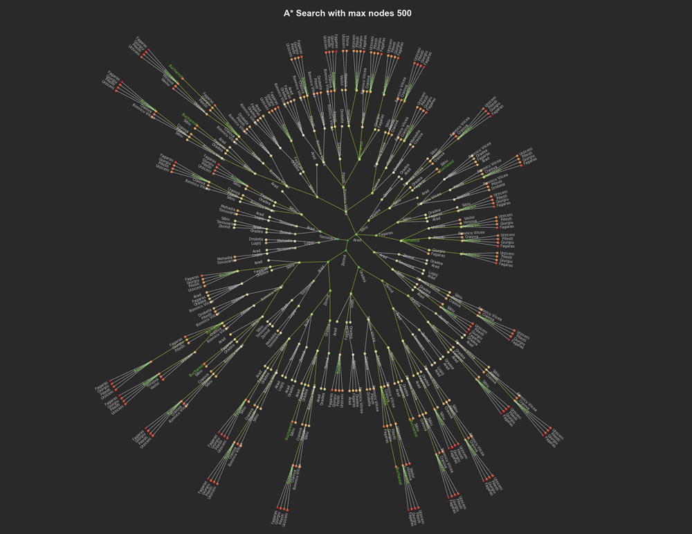

___
# Streaming Tweets Feature Learning with Spark
[Jump to repository](https://github.com/Xianlai/streaming_tweet_feature_learning)


#### As the diagram showing above, this project implements a pipeline that learns predictive features from streaming tweets and visualizes the result in real-time:

- **Receive streaming tweets on master machine**:    
    Running the TweetsListener.py script in the background, a tweets stream with 3 tracks-"NBA", "NFL" and "MBL" are pulled from Tweepy API. Inside this stream, each tweet has a topic about one of those 3 tracks and is seperated by delimiter "><". 

        example raw tweets:  
        Here's every Tom Brady Postseason TD! #tbt #NFLPlayoffs https://t.co/2CIHBpz2OW...  
        RT @ChargersRHenne: This guy seems like a class act.  I will root for him  
        RT @NBA: Kyrie ready! #Celtics #NBALondon https://t.co/KgZVsREGUK...  
        RT @NBA: The Second @NBAAllStar Voting Returns! https://t.co/urTwnGQNKl...  
        ...  

- **Analysis tweets on distributed machines**:    
    This stream is directed into Spark Streaming API through TCP connection and distributed onto cluster. Under the Spark Streaming API, the distrbuted stream is abstracted as a data type called DStream. A series of operations are then applied on this DStream in real time and transform it into other DStreams containing intermediate or final analysis results. 
    
    1. preprocess each tweet into a label and a list of clean words which contains only numbers and alphabets.
    
        ```
        example cleaned tweets after preprocessing:   
        tag:1, words:['rt', 'chargersrhenne', 'this', 'guy', ...],    
        tag:0, words:['rt', 'debruynekev', 'amp', 'ilkayguendogan', ...],    
        tag:0, words:['rt', 'commissioner', 'adam', 'silver', ...],    
        tag:0, words:['rt', 'spurs', 'all', 'star', ...],    
        tag:0, words:['nbaallstar', 'karlanthony', 'towns', 'nbavote', ...],   
        ...    
        ```

    2. count the frequencies of words in all tweets and take the top 5000 most frequent ones as features.
        
        ```
        example word count:  
        ('rt' , 196)  
        ('the', 174)  
        ('in' , 85)  
        ('for', 62)  
        ('to' , 59)  
        ...
        ```

    3. encode the tweets in last 15 seconds into a structured dataset using features mentioned above.
    
        ```
        example encoded dataset:  
        tag: 0, features: [1, 0, 0, 0, 0, 0, 0, 0, 0, 0, ...],  
        tag: 1, features: [1, 0, 0, 0, 0, 0, 0, 0, 0, 0, ...],  
        tag: 2, features: [1, 0, 0, 0, 0, 0, 0, 0, 0, 0, ...],  
        tag: 0, features: [0, 1, 1, 1, 1, 1, 0, 0, 0, 0, ...],  
        tag: 1, features: [0, 0, 1, 0, 0, 0, 1, 1, 1, 1, ...],  
        ...  
        ```

    4. calculate the conditional probability given label and the predictiveness of each feature word.
        
        ```
        most predictive word : (cp0, cp1, cp2, pdtn)  
        allstar     : (0.14835164835164835, 0.0078125, 0.05555555555555555, 249.3439)  
        alabama     : (0.005494505494505495, 0.140625, 0.05555555555555555, 216.67129)  
        fitzpatrick : (0.005494505494505495, 0.1328125, 0.05555555555555555, 195.5925333333333)  
        voting      : (0.12637362637362637, 0.0078125, 0.05555555555555555, 187.45217333333335)  
        minkah      : (0.005494505494505495, 0.125, 0.05555555555555555, 175.55554999999998)  
        draft       : (0.016483516483516484, 0.171875, 0.1111111111111111, 149.7176)  
        ...  
        ```

- **Visualize results on master machine**:   
    At last we select the tweets and features with higher predictiveness, collect their label, sum of predictiveness and 2 tsne features back onto the master machine and visualize them as a scatter plot. 

    1. keep only 300 most predictive features and discard other non-predictive features.
    2. calculate the sum of predictiveness of each word in tweet.
    3. take 60 tweets with the highest sum of predictiveness under each label.
    4. apply TSNE learning on these 300 data points to reduce dimentionality from 100 to 2 for visualization.
    
    This visualization can be used as an informal way to validate the predictiveness defined above. If the scatter circles of different labels are well seperated, then the features selected by this predictiveness measure are working well.


## Files
- **[tweet_feature_learning_SparkStreaming.ipynb](https://github.com/Xianlai/streaming_tweet_feature_learning/blob/master/Spark_machine_learning_pipeline.ipynb)**  
    This jupyter notebook contains the code receiving tweets from socket, learn features and their stats and visualize selected tweets using learned features.

- **[TweetsListener.py](https://github.com/Xianlai/streaming_tweet_feature_learning/blob/master/TweetsListener.py)**  
    This python script pulls realtime tweets from tweepy API and forward it to the assigned TCP connect.(If you are not using docker container, you need to modify the IPaddress information in this file as well as in tweet_feature_learning_SparkStreaming.ipynb to make the streaming work.)

- **[StreamingPlot.py](https://github.com/Xianlai/streaming_tweet_feature_learning/blob/master/StreamingPlot.py)**  
    This python script implements the streaming plotting class which generate a scatter plotting and keeps updating the plotting with new plotting data source.

- **[logs.txt](https://github.com/Xianlai/streaming_tweet_feature_learning/blob/master/logs.txt)**   
    This text file is generated in tweet_feature_learning_SparkStreaming.ipynb to save intermediate and final analysis result.

- **[Spark_overview.md](https://github.com/Xianlai/streaming_tweet_feature_learning/blob/master/Spark_overview.md)**  
    This markdown file briefly introduces what is Spark and the functionalities of it.

- **[Spark_installation_guide.md](https://github.com/Xianlai/streaming_tweet_feature_learning/blob/master/pyspark_installation_guide.md)**  
    This markdown file contains guiding steps on how to install Spark, pyspark and how to run them either in the shell or as an application.

- **[Spark_AWS_cluster_guide.md](https://github.com/Xianlai/streaming_tweet_feature_learning/blob/master/Spark_AWS_cluster_guide.md)**  
    This markdown file contains guiding steps on how to set up a AWS cluster and how to run Spark on it.

- **[Spark_machine_learning_pipeline.ipynb](https://github.com/Xianlai/streaming_tweet_feature_learning/blob/master/Spark_machine_learning_pipeline.ipynb)**  
    This jupyter notebook implements an example using Spark machine learning API to classify whether online news are popular or not.


___
# Mahattan Rental Apartment Clustering
[Jump to repository](https://github.com/Xianlai/Manhattan_rental_apartment_clustering)

A city functions like a gigantic sophisticate network. Within it each buildings and blocks are connected by visible transportation systems and invisible functional dependencies. On the other hand, the difference of locations and functionality also divides the city into many sub-areas. 

For different purposes, the boundaries of these sub-areas are different. Like for political administration, we have boroughs, community districts and neighbourhoods, and for postal service, we have zip codes. 

In this projet, I made use of rental apartment online listing dataset and new york building footprint dataset to explore the possible geographic boundaries or patterns of apartment rental market. Equivalent to finding boundaries, clustering are performed to find the best grouping of buildings with respect to their location and rental market popularity and then we show how different properties like bedroom number, is there elevator in building, is there fitness center in building etc affect the clustering patterns.


This project is consist of 2 parts:

- **clustering model selection**  
    
    1. Interpolate the popularity of every building in the building dataset.

        Based on assumption that popularity of buildings are similar to their surrounding buildings', I use inverse distance weighting (IDW) as my interpolation method to get popularity value for each data point in building dataset from listing dataset.

    2. Cluster the buildings with location and popularity.
        
        With every building assigned popularity values, I performed hierarchical clustering using their longitude, latitude and the popularity.

    3. Evaluate the interpolation and clustering models with different parameter combination and select the best one for this project.
    
        In the previous 2 phases, there are 4 parameters: 

            - n_neighbors: number of neighbor building to consider during interpolating    
            - IDWpower: controlling power of IDW    
            - linkage: method to calculate distance between clusters    
            - metric: method to calculate distance between buildings    

        We use 6 criteria to evaluate each model. And through studying how these criteria behave and diverse, we choose whether to fuse score or rank of each scoring system for picking final model.

            - n_singlton : The number of singleton clusters.  
            - smClusterSize: The cluster size at the 15th percentile ranking from small to big.  
            - lgClusterSize: The cluster size at the 85th percentile ranking from small to big.  
            - lgClusterArea: The cluster area at the 85th percentile ranking from small to big.  
            - interVariance: The within cluster popularity variance.  
            - intraVariance: The between cluster popularity variance.  

- **Query clustering with different conditions**  
    
    1. Query clustering using cluster statistics

        In the process of clustering, we calculate some statistics for each cluster:

            - Popularity mean  
            - Popularity variance  
            - cluster size  
            - cluster area  

        We can either use them to filter clusters, (For example, we can filter out 100 clusters with highest popularities.) or use them as color coding to visualize these clusters. (For example, we can plot the clusters colored by their popularity mean.)
        
    2. Query clustering using different building properties
    
        Since the listing dataset contains information about building properties like price, fitness centers, bedroom numbers etc, we can produce different subset of listing data and interpolate the building popularity from this subset and hence get a different clustering. (For example, if we want to compare the clustering of high-price rentals to that of low-price rentals, we can create 2 subsets, get 2 clusterings and compare the difference in final plottings.)

## Files:
- **1_model selection.ipynb**:   
    shows the process of clustering model selection

- **2_clustering.ipynb**:   
    shows the how to make use of clustering to query information we are interested in and compare clusterings with different apartment properties.

- **interactive_clusters.py**:  
    makes interactive plotting using bokeh server.

    Besides making static plotting, we can also query the clustering interactively with the help of bokeh server. Simply run `$ bokeh serve --show interactive_clusters.py` in the command line, the interactive plotting will be availabel at http://localhost:5006/, you can use web browser to play with it.

___
# Online News Popularity Classification
[Jump to repository](https://github.com/Xianlai/online_news_popularity_classification)

Facilitated by the fast spreading and developing of internet and smart devices, how can we understand online news browsing data and find the pattern inside it become more and more important.

In this project I am using online news popularity data set containing 39644 news articles and 57 features about each article including statistical features like number of words in title, rate of non-stop words in the content, article publish weekdays etc. and NLP features like positive word rate, title subjectivity level etc. The goal is to classify whether these articles are popular or not quantified by article shares. 

The main motivation of this project is setting up a systematic framework to:

    1. Understand the dataset including noises and possible hidden features can be extracted. 
    2. Visualize the behaviors of different learning models and observe how they interact with this dataset.
    3. Compare the behavior and performance of those learning models.

To limit the size of Jupyter notebooks, I split this project into 2 parts: preprocessing and model fitting selection.

- **Preprocessing**

    1. Explore the statistical figures like mean, std, range, unique value/outlier counts and feature data types of dataset.
    
    2. Clean the dataset by merging related binary features, standard scale features, remove outliers etc.   
        

    3. Using matrix decomposition methods to reduce dimensionality and  generate possibly more predictive feature spaces.
    
        1. original
        2. PCA
        3. sparsePCA
        4. FactorAnalysis
        5. NMF
    
        


- **Model fitting and selection**

    1. Fit different learning models on the cleaned dataset under different feature space and test different hyper-parameter combinations using grid searching. 
    
        1. Naive Bayes
        2. Logistic Regression
        3. SVM
        4. k-Nearest Neighbours
        5. Random Forest
        6. XGBoost

    2. Visualize the results of parameter tunning to observe how each of the parameters changed the model's behavior on this dataset.
    
        

    3. Visualize the decision boundaries to tell how classifiers adapt themselves on this dataset and identify possible problems.
    
        

    4. Evaluate and compare the performance of classifiers under different spaces using expected loss which considers both model flexibility and steadiness.
        
        

    5. Compare the prediction "confidence" of classifiers by plotting the confusion histogram. This allows us further examine the behavior of classifiers and identify possible problems.
        
        


## Files:
- **0_Preprocessing.ipynb**:   
    This Jupyter notebook contains code preprocesses the original dataset.

- **1_Model fitting and selection.ipynb**:   
    This Jupyter notebook contains code fits different learning models on cleaned dataset and compares the learning results.

- **modules/LearningPipe.py**:  
    This python code implements a wrapper class based on several sklearn models to perform feature selection, grid searching, cross validation and evaluation jobs. It also provides methods to visualize parameter tuning and decision boundaries. 

- **modules/Visual.py**:  
    This python code implements visualization class for basic plotting jobs. Both python files are imported as modules in the Jupyter notebooks.


___
# General Tree Search and Visualization
[Jump to repository](https://github.com/Xianlai/online_news_popularity_classification)

Searching is one of the most flexible way to deal with problem that can't be solved directly and exactly. By systematically exploring the state space, we will eventually reach the goal state we are looking for. If what we are interested is the path from initial state to goal state, then we need to save the states and orders we explored in a tree structure.

This small project includes implementation of a general tree search algorithm module that can employ different searching strategies like depth-first search, iterative deepening search, A* search etc. and a visualization module that can visualize the result search tree nicely.



Searching is one of the most flexible way to deal with problem that can't be solved directly and exactly. By systematically exploring the state space, we will eventually reach the goal state we are looking for. If what we are interested is the path from initial state to goal state, then we need to save the states and orders we explored in a tree structure.

This small project includes implementation of a general tree search algorithm module that can employ different searching strategies like depth-first search, iterative deepening search, A* search etc. and a visualization module that can visualize the result search tree nicely.

## How to use the modules
See [TreeSearch_and_Visualization.ipynb](https://github.com/Xianlai/Tree-Search-and-Visualization/blob/master/TreeSearch_and_Visualization.ipynb) for usage examples.


## Files
- **TreeSearch.py**
    This python script implements the general tree search algorithms. It includes the basic operations of tree search, like expand downward, trace backup etc, and different search strategies like BFS, DFS, A* etc. It should be used as parent class for specific problem instance.

- **TreeVisual.py**
    This python script implements the class to visualize the result search tree. It includes the methods to parse the search tree in order to get plot data and the methods to plot the tree based on the attributes of its nodes like whether is goal node or whether is path. 

- **TreeSearch_and_Visualization.ipynb**
    This jupyter notebook contains the code illustrate how to use TreeSearch object and TreeVisual object to solve specific problem and visualize the result search tree.

- **RoadtripProblem.py**
    This python script implements an example problem of finding the best route in Romania to show the functions of its parent class--TreeSearch class.

- **Documentations.md**
    This markdown file contains the documentation of TreeSearch, TreeVisual and RoadtripProblem classes.


